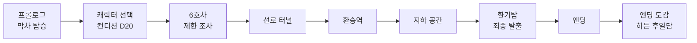
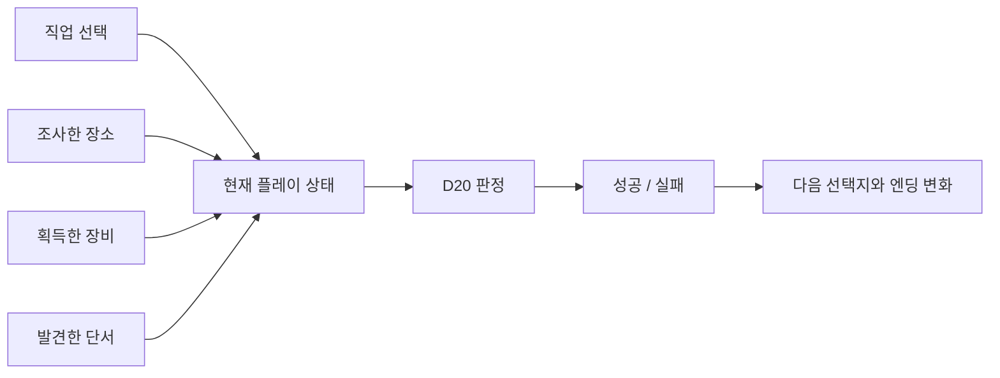
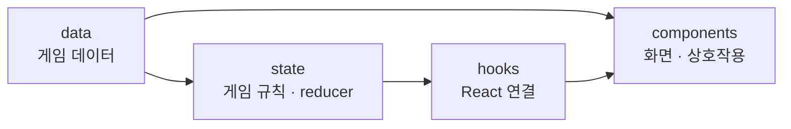
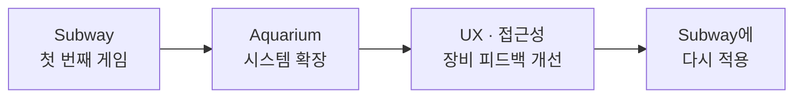

# 심야 지하철: 사라진 다음역

> **막차가 멈췄다.
> 불이 다시 켜졌을 때, 같은 칸의 승객들은 모두 사라져 있었다.**

`심야 지하철: 사라진 다음역`은 제한된 조사와 D20 판정으로 지하철을 탈출하는 **React 기반 텍스트 호러 TRPG**입니다.

각 구역에는 조사할 장소가 여섯 곳 있지만, 확인할 수 있는 곳은 세 곳뿐입니다.

무엇을 조사했는지, 어떤 도구를 챙겼는지, 어떤 단서를 눈여겨봤는지가 한참 뒤의 위기에서 다시 영향을 줍니다.

<p align="center">
  <a href="https://subway-trpg.vercel.app/"></a>
  <a href="https://github.com/tichieeee1023/aquarium-trpg"></a>
</p>

<p align="center">
  
  
  
  
</p>

<p align="center">
  
</p>

---

## 목차

* [프로젝트 개요](#프로젝트-개요)
* [어떤 게임인가요?](#어떤-게임인가요)
* [게임 진행](#게임-진행)
* [플레이 시스템](#플레이-시스템)
* [이전 선택을 다시 체감시키는 장비 피드백](#이전-선택을-다시-체감시키는-장비-피드백)
* [엔딩 도감](#엔딩-도감)
* [React로 어떻게 만들었나요?](#react로-어떻게-만들었나요)
* [프로젝트 구조](#프로젝트-구조)
* [플레이 편의와 접근성](#플레이-편의와-접근성)
* [테스트](#테스트)
* [실행 및 검증](#실행-및-검증)
* [두 번째 게임을 만들고 다시 돌아왔습니다](#두-번째-게임을-만들고-다시-돌아왔습니다)

---

## 프로젝트 개요

|     |                                            |
| --- | ------------------------------------------ |
| 장르  | 브라우저에서 바로 플레이하는 한국어 텍스트 호러 TRPG            |
| 배경  | 비 내리는 새벽, 서울 지하철 막차                        |
| 플레이 | 5개 캐릭터 아키타입 · D20 판정 · 구역별 제한 조사           |
| 핵심  | 조사한 장소·획득한 도구·발견한 단서가 이후 판정에 영향            |
| 목표  | 객차와 역을 빠져나와 환기탑을 통해 지상으로 탈출                |
| 엔딩  | BAD 3종 · NORMAL · GOOD · TRUE, 총 6개 수집형 결말 |

이 게임의 핵심은 단순히 정답을 찾아 다음 방으로 넘어가는 것이 아닙니다.

**제한된 조사 기회 안에서 무엇을 확인하고 무엇을 포기할지 선택하고, 그 선택의 결과가 이후의 위기에서 다시 돌아오는 것**을 목표로 만들었습니다.

---

## 어떤 게임인가요?

* 🎲 **D20 판정**
  캐릭터 능력치와 상태에 따라 같은 선택도 결과가 달라집니다.

* 🔎 **6곳 중 3곳만 조사**
  모든 장소를 확인할 수 없습니다. 도구를 찾을지, 위험을 미리 조사할지 선택해야 합니다.

* 🎒 **아이템과 단서의 재사용**
  초반에 챙긴 도구가 후반의 판정과 탈출 방식에 다시 영향을 줍니다.

* 🚇 **이어지는 공간**
  객차에서 시작해 선로, 역, 지하 공간, 환기탑까지 하나의 탈출 흐름으로 이어집니다.

* 📚 **6개의 엔딩**
  BAD / NORMAL / GOOD / TRUE 엔딩을 수집하고, 모든 기록을 모으면 추가 후일담이 열립니다.

---

## 게임 진행



처음에는 멈춘 열차에서 빠져나가는 것이 전부처럼 보입니다.

하지만 선로를 지나 익숙한 역에 도착한 뒤부터, 플레이어가 알고 있던 공간과 실제 공간 사이에 조금씩 이상한 점이 생기기 시작합니다.

각 스테이지는 독립된 미니게임이 아니라 하나의 사건으로 이어집니다.

초반에 얻은 도구와 정보가 한참 뒤의 상황에서도 다시 사용되기 때문에, 이전 선택을 기억하며 진행하게 됩니다.

---

## 플레이 시스템

### 캐릭터와 D20

플레이 시작 시 서로 다른 성향의 캐릭터를 선택하고, D20으로 그날의 컨디션을 결정합니다.

```text
판정값 = D20 + 능력치 보정 + 특성 / 장비 보정
```

Natural 20은 대성공, Natural 1은 대실패로 처리됩니다.

HP 또는 SAN이 0이 되면 생존에 실패합니다.

---

### 제한 조사

주요 구역에는 조사 가능한 장소가 6곳 존재하지만 사용할 수 있는 행동력은 3입니다.

모든 것을 확인할 수 없기 때문에 매번 선택해야 합니다.

> 위험을 미리 알아볼까?
> 도구를 찾을까?
> 회복 수단을 확인할까?
> 아니면 아무것도 없을지도 모르는 장소를 조사할까?

조사 결과도 항상 유용하지 않습니다.

* 생존 도구
* 후속 판정에 필요한 단서
* 회복 아이템
* 위험 정보
* 허탕
* HP / SAN 손실

등이 섞여 있습니다.

---

### 무엇을 골랐는지가 다음 판정을 바꿉니다

직업, 아이템, 조사 기록, 현재 상태는 각각 따로 존재하는 것이 아니라 다음 판정에 함께 영향을 줍니다.



예를 들어 같은 사건에서도

* 관련 장비를 가지고 있으면 DC가 낮아지고,
* 특정 정보를 조사했다면 위험을 미리 알고 대응하며,
* 보호 장비가 있으면 실패 피해가 줄고,
* 특정 아이템 조합이 있다면 새로운 해결 방법이 열립니다.

그래서 플레이 결과가 단순히 주사위 운으로만 결정되지 않도록 했습니다.

---

## 이전 선택을 다시 체감시키는 장비 피드백

아이템 효과는 코드 안에서 숫자만 바뀌는 것으로 끝내지 않습니다.

플레이어가 이전에 얻은 장비나 정보가 다시 사용되는 순간, **왜 현재 결과가 달라졌는지 화면에서 직접 보여주는 것**을 중요하게 생각했습니다.

```text
초반 조사
↓
아이템 / 정보 획득
↓
한참 뒤 위기 발생
↓
과거 장비 또는 단서가 다시 등장
↓
판정 / 피해 변화
↓
결과
```

### 장비가 행동의 원인일 때

```text
장비 사용
→ 판정
→ 결과
```

예를 들어 랜턴으로 위험 요소를 먼저 확인하거나, 특정 공구를 사용해 장치를 조작하는 경우입니다.

장비 이미지와 사용 연출을 먼저 보여준 뒤 실제 판정으로 이어집니다.

---

### 보호 장비가 피해를 줄일 때

```text
위험 발생
→ 장비 효과 발동
→ 감소된 피해
```

절연 장갑처럼 **실패한 뒤 플레이어를 보호하는 장비**는 위험이 발생한 후 등장합니다.

이를 통해

> “실패했는데, 아까 챙긴 장비 덕분에 살았다.”

는 흐름을 직접 체감할 수 있도록 했습니다.

---

### 조사 정보가 도움이 될 때

아이템뿐 아니라 조사로 얻은 정보도 후속 판정에 사용됩니다.

```text
과거 조사 정보 회상
→ 판정 난이도 감소
→ D20 판정
```

예를 들어 이전에 시설 구조를 확인했다면 후반 장치의 위치를 이미 알고 있는 식입니다.

단순히 `DC -2`라고 표시하기보다 **왜 난이도가 낮아졌는지 먼저 보여주는 것**을 목표로 했습니다.

---

## 엔딩 도감

총 6개의 엔딩이 존재합니다.

* BAD END × 3
* NORMAL END
* GOOD END
* TRUE END

첫 엔딩을 보기 전에는 도감이 잠겨 있으며, 확인한 엔딩은 브라우저 `localStorage`에 저장됩니다.

모든 엔딩을 수집하면 **04:44 AM — 폐쇄회로 밖의 기록** 후일담이 열립니다.

플레이 회차를 다시 시작해도 엔딩 수집 기록은 유지됩니다.

개발 및 검증을 위한 전체 해금 기능도 별도로 제공합니다.

* PC: **`Ctrl + Shift + F10`**
* 모바일: **`SYSTEM NOTES`를 5번 탭**

실행 후 확인 모달에서 전체 해금을 선택하면 모든 엔딩 기록을 바로 확인할 수 있습니다.


---

## React로 어떻게 만들었나요?

게임 화면을 만드는 것보다 먼저 고민했던 것은 **게임 상태가 서로 어떻게 영향을 주는가**였습니다.

플레이 중에는 다음과 같은 값이 동시에 변화합니다.

* HP / SAN
* 남은 행동력(AP)
* 캐릭터 능력치와 특성
* 인벤토리
* 조사 완료 장소
* 획득한 정보
* 시나리오 플래그
* 현재 Stage
* 주사위 판정 결과
* 최종전 상태
* 엔딩 조건

이를 React의 reducer와 단계별 handler로 관리합니다.

```text
사용자 행동
→ 게임 규칙 처리
→ 상태 업데이트
→ 조건 재평가
→ 화면 변경
```

실시간 물리나 3D 이동이 중심인 게임이 아니기 때문에 별도의 게임 엔진을 사용하지 않았습니다.

이 프로젝트의 핵심은

> **사용자의 선택이 상태를 바꾸고, 바뀐 상태가 다시 UI와 다음 선택지를 바꾸는 것**

이었기 때문에 React 자체의 상태 관리 구조를 게임 진행 시스템으로 사용했습니다.

---

## 프로젝트 구조

코드는 데이터, 게임 규칙, React 연결부, UI 역할을 나눠 관리합니다.



```text
src/
├── components/  # 화면, 내러티브, 인벤토리, 모달, 도감
├── data/        # 캐릭터, 아이템, 장면, 조사, 엔딩
├── hooks/       # 게임 엔진, 설정, 사운드, 엔딩 수집
├── state/       # reducer, 게임 규칙, 단계별 handler
└── utils/       # D20, 이야기 흐름, 공통 규칙
```

### `data`

게임에 **무엇이 존재하는지** 관리합니다.

* 캐릭터
* 아이템
* 조사 장소
* 장면
* 엔딩

### `state`

플레이어의 행동이 발생했을 때 **게임 상태가 어떻게 변하는지** 관리합니다.

* reducer
* 게임 규칙
* 스테이지별 handler
* 인벤토리 처리

### `hooks`

게임 상태와 React 화면을 연결합니다.

* 게임 엔진
* 사운드
* 설정
* 엔딩 수집
* 타이핑 효과

### `components`

현재 상태를 플레이어에게 보여주고 입력을 받습니다.

게임 규칙을 컴포넌트 안에 계속 추가하지 않고 역할별로 분리해, 시나리오가 늘어나도 화면 코드가 지나치게 복잡해지지 않도록 구성했습니다.

---

## 플레이 편의와 접근성

다중 엔딩 게임은 같은 장면을 여러 번 플레이하게 되기 때문에 **두 번째 회차부터 불편해지는 요소**를 줄이는 기능도 함께 추가했습니다.

### 반복 플레이

* 프롤로그 자동 생략
* 직접 건너뛰기
* 주사위 연출 생략
* 홈 이동 후 이어하기
* 현재 회차만 다시 시작
* 엔딩 도감 유지

### 모바일

* 모바일 전용 인벤토리 접근
* 선택지 터치 영역 확대
* 긴 제목 줄바꿈 보정
* 아이템명 overflow 대응
* 장면 이미지 크기 조정

### 접근성

* 글씨 크기 설정
* 플래시 / 암전 효과 감소
* `prefers-reduced-motion` 대응
* 움직임 효과 ON / OFF

Web Audio API를 활용해 클릭·판정·장면 전환 효과음을 합성하고, Canvas는 모든 엔딩을 수집한 뒤의 완주 연출에 사용했습니다.

---

## 테스트

게임 규칙은 UI와 분리해 자동 테스트할 수 있도록 구성했습니다.

주요 테스트 범위는 다음과 같습니다.

* reducer 상태 불변성
* D20 Natural 1 / Natural 20
* 캐릭터 컨디션 경계값
* AP 감소 및 조사 제한
* 아이템 획득 / 사용 / 소모
* 없는 아이템 사용 방지
* 보호 장비 피해 감소
* 조사 정보에 따른 DC 변화
* HP / SAN 0 처리
* 핵심 BAD END 분기
* 정상 탈출 경로
* 최종전 상태 전이
* 회복 아이템 최대치 제한
* 엔딩 저장값 검증

UI를 직접 눌러보는 테스트와 별도로 게임 규칙 자체의 입력과 결과도 확인할 수 있도록 했습니다.

---

## 실행 및 검증

```bash
npm install
npm run dev
```

검증:

```bash
npm run lint
npm test
npm run build
```

이미지 최적화:

```bash
npm run optimize:images
```

브라우저 흐름 검증 스크립트는 `tools/` 폴더에서 관리합니다.

---

## 두 번째 게임을 만들고 다시 돌아왔습니다

`심야 지하철`을 완성한 뒤 같은 TRPG 구조를 발전시켜 두 번째 작품 **아쿠아리움: 심해의 균열**을 제작했습니다.



아쿠아리움을 만들면서

* 직업별 플레이 차이
* 장비 효과 피드백
* 모바일 인벤토리
* 반복 플레이 설정
* 접근성 옵션
* 엔딩 완주 연출
* 장비 사용 모달
* 조사 정보 피드백
* 테스트 구조

등을 더 세밀하게 다루게 되었습니다.

그리고 그 과정에서 좋아졌던 부분을 다시 첫 번째 프로젝트에 적용했습니다.

현재의 `심야 지하철`은 최초 완성본에서 멈춘 프로젝트가 아니라,

**후속작을 만들며 얻은 경험을 다시 반영해 고도화한 대표 프로젝트**입니다.

---

<details>
<summary><strong>상세 개발 기록 보기</strong></summary>

### 장면·반응형 레이아웃

* 모바일에서 긴 한국어 제목이 어절 중간에서 끊기지 않도록 줄바꿈 규칙을 수정했습니다.
* PC에서는 장면 이미지를 크게 보여주고, 세부 설명은 별도로 펼칠 수 있도록 구성했습니다.
* 선택지의 터치 영역과 헤더 아이콘 정렬을 조정했습니다.
* 최종장 경고 정보와 선택 버튼이 같은 강조색으로 경쟁하지 않도록 색을 분리했습니다.

### 엔딩·도감

* 6개의 엔딩과 히든 후일담을 수집할 수 있습니다.
* 엔딩 기록은 `localStorage`에 저장합니다.
* 모든 엔딩을 수집하면 완주 일러스트와 Canvas 축하 연출이 표시됩니다.
* 현재 회차 초기화와 엔딩 도감 초기화를 분리했습니다.

### 장비·조사 정보 피드백

* 장비가 판정을 가능하게 만드는 경우 `장비 사용 → 판정 → 결과` 순서로 보여줍니다.
* 보호 장비는 `위험 발생 → 장비 효과 → 감소된 피해` 순서로 보여줍니다.
* 이전에 얻은 조사 정보가 DC를 낮추는 경우 판정 전에 해당 단서를 다시 보여줍니다.
* 초반 아이템을 후반에 재사용할 때는 별도의 `장비 재사용` 맥락을 제공합니다.
* 장비 효과는 아이템 이미지와 함께 별도 모달로 보여줍니다.

### 사운드와 연출

* Web Audio API로 클릭, 판정, 장면 전환 효과음을 합성했습니다.
* 플래시와 암전 효과는 사용자 설정과 `prefers-reduced-motion`을 따릅니다.
* 구역 전환음은 게임 분위기에 맞게 짧고 무거운 음으로 조정했습니다.

### 반복 플레이 UX

* 프롤로그 자동 생략
* 주사위 연출 생략
* 현재 회차 재시작
* 이어하기
* 엔딩 도감 유지
* 모바일 인벤토리

등 다회차 플레이에서 반복되는 불편을 줄이는 기능을 추가했습니다.

### AI 활용

기획 정리, 코드 검토, 디버깅 및 일부 제작 과정에서 다음 도구를 활용했습니다.

* OpenAI GPT
* OpenAI Codex
* Google Gemini

일부 비주얼 에셋은 생성형 AI를 활용해 제작했습니다.

AI가 생성한 결과를 그대로 사용하는 방식보다, 프로젝트의 시나리오와 인터랙션 목표에 맞게 수정하고 구현하는 방식으로 활용했습니다.

</details>

---

## Developer

**Planning / Frontend Development — Lee YJ**

사용자의 선택이 단순히 다음 화면으로 이동하는 것이 아니라,
**이후의 상태와 경험까지 바꾸는 인터랙티브 웹을 만들고 있습니다.**
